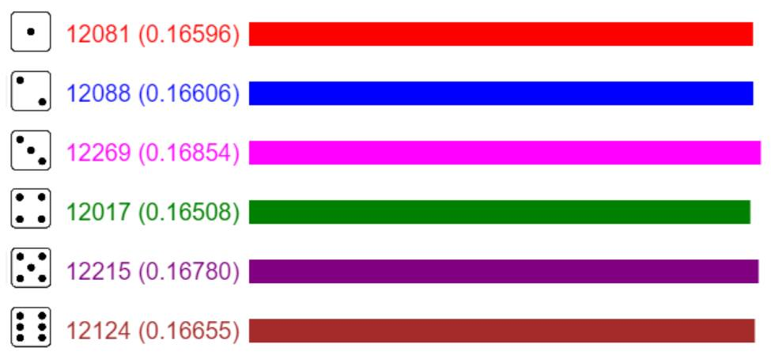

 <h1 align="center">Canvas-Probability</h1>

## Introduction
Minh họa xác suất của các mặt trên súc sắc bằng Canvas. Khi số lượt gieo súc sắc đủ lớn, số lần xuất hiện của mỗi mặt sẽ xấp xỉ bằng nhau, nói cách khác thì xác suất xuất hiện mỗi mặt đều bằng 1/6.

## Demo
 

## Tutorial
https://huynhphusi.com/thuc-nghiem-xac-suat-doi-voi-suc-sac-bang-canvas-va-javascript/
